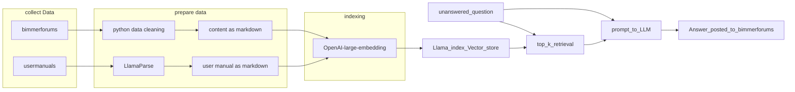
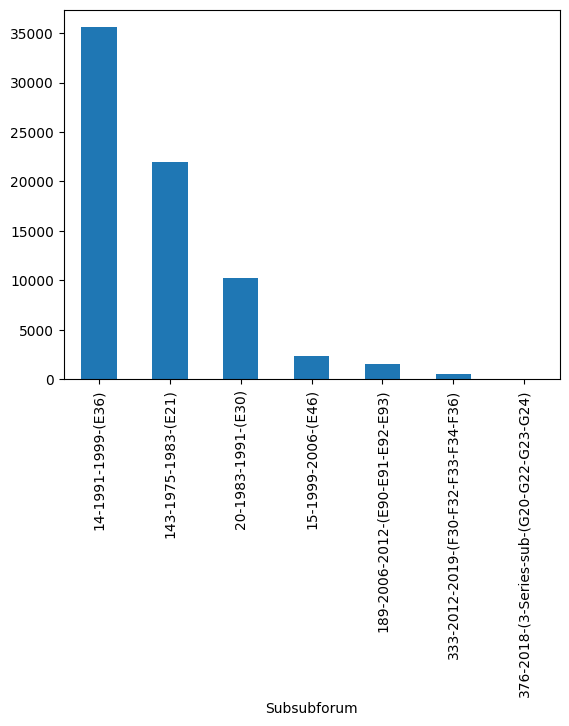
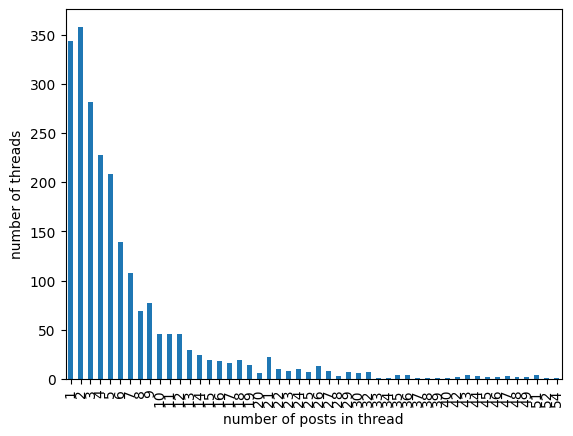
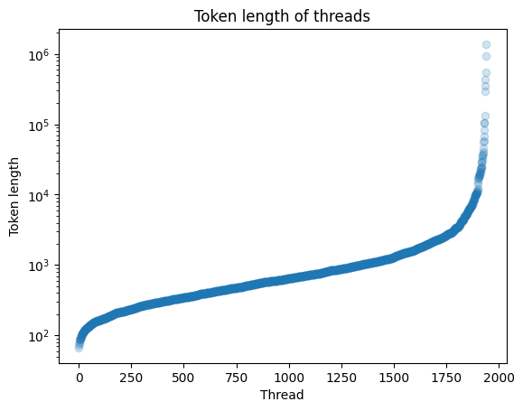
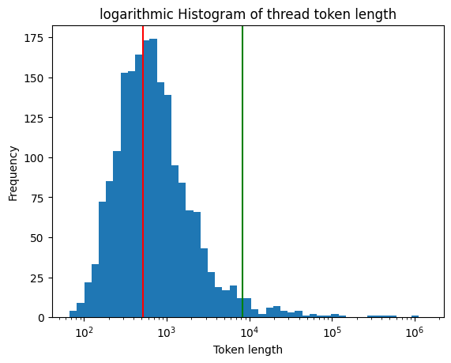

# BMW_RAG_support_bot

This is a RAG (retrieval augmented generation) System to answer technical questions on BMW cars.
The system is grounded with data from a BMW forum and the user manuals for the cars (in English).
To reduce complexity and cost, the data is limited to data for the 3er and 4er Series of BMW cars.
In production, the system is meant to pull new or unanswered questions from the forum and try to answer the questions. If applicable, the LLM shall ask for more information.



## Open Issues and Improvements

- quotes are not correctly represented in the markdown of the forum content
- the text splitting should be markdown aware, to split right before a heading
- give the model a thinking scratch pad
- if the model thinks, that it is not confident in its answer, then it should return a special string
- Optimize the embedding (maybe smaller chunks)
- experiment with advanced retrieval techniques
- use Cohere Reranker
- summarize the unanswered question before the embedding search
- develop a server, that listens to new unanswered questions and answers them.
- scrape more data (more subforums)
- scrape more forums
- improve user-manuals formatting errors with an LLM
- use images and linked images, by implementing a multimodal LLM workflow

## Development Journey

This shows my journey in developing this software

### scrape data from Bimmerforums

I chose BMW because I thought BMW owners are the kinds of people, who work on their cars a lot instead of just giving it to the repair shop, so there should be more data on BMW cars out there.
|Name|num beiträge /1k|notiz|technologie|
|-|-|-|-|
|<http://www.motor-talk.de/>|7767||React|
|<https://bmw-forum.de/>|162||vBulletin|
|<http://www.bmw-syndikat.de/>|2866||iis server|
|<http://www.auto-treff.com/>|946||php|
|<http://www.gs-forum.eu/>||nur motorad|firebase|
|<http://www.1erforum.de/>|2026|nur 1er und 2er|xenForo|
|<http://www.autotechnik-forum.de/>|11||RSS; phpBB|
|<https://www.bimmerforums.com/forum/forum.php>|34512|"in englischer Sprache; Crawl-delay: 1600"|RSS; vBulletin 4.2.5|
|<https://www.m-forum.de/forum/index.php>|1222||vBulletin|
|<https://www.7-forum.com/forum/>|195|nur 7er|vBulletin|

There are lots of forums in German language, but Bimmerforums is the only one in English language.
Because most LLMs are primarily trained on English language, Bimmerforums is chosen.

Bimmerforums has lots of posts, but I realized, that I may not be able to handle all this data, because
embedding and LLM calls are costly.
Because of the financial restraint, the data scraping is limited to the 3er and 4er BMW subforum.

### get the user manuals

I got most of the pdfs by manually downloading from the official download link <https://driversguide.bmw.com/index.html>
The rest I got with Google  
"bmw e21 user manual filetype:pdf"

### Analyze the forum data

I have a total of 2_291 Threads with 72_376 posts and 4_078_144 words



Most Threads have only a few answers. About 340 Questions have 0 answers.  
There are some threads (not shown in the graph below), that have up to 15_705 posts


### Prepare forum content

Before ingesting the content into my RAG system, I need to prepare the content:

- remove Questions without answers
- anonymize users
- remove picture threads (threads with no info, just people showing off their beautiful Bimmers :D)
- remove selling thread (thread where people sell items)
- remove base64 encoded images (my LLM and my encoder can not handle these effectively)

With these Data-cleaning operations, I removed about 60% of the tokens in my content.  
This saves me money and time for the indexing of my data and my data quality is much better.

The content I scraped from the forum is in the form of individual posts. I want to have the content in the format of a markdown document for each thread.

The format looks like the following:

```txt
# <Title>

## Question of <username>

Posted on <Date>

<Post>

## Answers

### Post of <username>

<Post>

### Post of <username>

...
```

### Indexing the Content

#### How big should my chunks be?

This was a difficult question for me to answer and it took a lot of experimentation to find an acceptable answer.  

Coheres website says:  
Embeddings perform best when the text to be embedded is less than 512 tokens. You can create up to 96 embeddings per API call.

Embed model stats:
| model | embedding dimension | max input tokens | cost per million |
| -- | -- | -- | -- |
| text-embedding-3-large | 3072 | 8191 | 0.13 |
| text-embedding-3-small | 1536 | 8191 | 0.02 |
| text-embedding-ada-002 | 1536 | 8191 | 0.10 |
| Cohere-embed-english-v3.0 | 1024 | 512 | 0.10 |

I want to know how many of the threads I can incorporate in just one chunk,
and how many Threads I need to split up.

The following chart shows all 2000 Threads and how many tokens they have



In the following logarithmic histogram, I set to vertical lines. The red one shows the 512 token limit of the cohere embedding model
The green one shows the 8191 limit of the Open AI embedding models



#### The trade-off for the chunk size

- The chunks need to be smaller than the max token limit of the embedding model
- The chunks should be as small as possible without losing context
- The chunks should be small, so that after the retrieval they do not overwhelm the context window of the LLM
- In one chuck there shall never be multiple documents / Threads
- I would love to have the question and the answer in the same thread.

Based on all these considerations I set my max chunk size to 512 tokens.

#### How to split the chunks

This was also quite a hard problem because the splitters of the llama index library were not behaving transparently and did not split the text in the way I want them to.

I could not figure out a simple way to get all of the nodes from the index, or just get the length of the indexed batches.
Based on the nodes_dict in the index_store.json of the locally stored embedding save file.

I tried using the default:

```python
index = VectorStoreIndex.from_documents(
    documents=documents, embed_model=embed_model, show_progress=True
)
```

With this workflow, the splitting of the chunks is not configurable.  
When using the cohere embedding, I noticed, that there is a discrepancy between the total tokens in my input and the total tokens I was billed. This indicates, that some chunks may have been truncated to the max token limit of 512. This would be an error in the text-splitting pipeline.

Later I found, that I was not able to set the tokenizer in the LlamaIndex library to use the Cohere Tokenizer. This caused the Text splitter to make some chunks that are below the 512 token limit using the open AI tokenizer but above the 512 token limit using the cohere Tokenizer.  
Using the text splitter of LlamaIndex I got the following result:  
max length of cohere: 623  
max length of OpenAI: 503

Because of this, I decided to use the OpenAI embed model.  

The workflow with the customized Text splitter looks like the following:

```python
splitter = SentenceSplitter(
    chunk_size=512,
    chunk_overlap=50,
)
nodes = splitter.get_nodes_from_documents(documents_full, show_progress=True)
index = VectorStoreIndex.from_documents(
    documents_full,
    transformations=[splitter],
    show_progress=True
)
```

I tried to use the MarkdownNodeParser like so:

```python
from llama_index.core.node_parser import MarkdownNodeParser
parser = MarkdownNodeParser()
nodes = parser.get_nodes_from_documents(documents_full[500:550], show_progress=True, chunk_size=512)
```

But this Parser split the text in unexpected ways.  
Here is a snippet of its splits:  
(_____) Indicates a split between chunks.

```text
now assembled in the correct order, but is behaving worse than the mis-
assembly that I found when I took it apart.  
Anyone have any ideas? TIA
____________________
Answers
____________________
Post of username#465

Bump
____________________
Post of username#2

I'm not 100% sure about your dilemma. My car had an issue when re-installing
the wheel and (I didn't get to do this), but I believe I needed to loosen the
bolt holding the steering shaft to the steering rack to allow the shaft to
move up a bit.  
  
[https://www.realoem.com/bmw/enUS/sho...diagId=32_0671](https://www.realoem.com/bmw/enUS/showparts?id=BK03-USA-05-1998-E36-BMW-M3&diagId=32_0671)
____________________
E36 suspension setup issue
____________________
Question of username#4535

Posted on 2023-04-15 13:31:00-04:00

Hi, I have a 1997 328i that was mostly stock except for a set of cheap ap
```

The markdown parser removes the formatting, which I think is bad, because there is useful information in the formatting, that the LLM is trained to understand and utilize.  
In addition the splitts are wierd. It puts the top two headings in separate chunks, losing all the context and reducing the information in one chunk. I can not imagine this splitting is good, but maybe I should give it a shot and evaluate its performance in the retrieval step. For now, I won't do that.

#### Embedding

For the embedding, the OpenAI text-embedding-3-large is chosen because it should have a better performance than text-embedding-3-small or text-embedding-ada-002.

#### Vector store

For the Vector Database, the standard LlamaIndex Database is used. Currently, this is Chroma DB.
Two databases are used, one for the Forum Content and one for the user manuals.

### Retrieval

The QueryPipeline is too confusing to be used. LlamaIndex has implemented some "magic" to make the output and input parameters match, but this magic is hidden and I can not observe what it does and how it works.
Thus, I was not able to make it work.  
Instead, the pipeline is chained together simple function.  

```python
# make my own
user_query = """Howdy Folks!

First post here. Recently did my OFHG as i was leaking coolant. I threw a check engine light after that read (EGR Cooler B Below Efficiency) so i took it to the dealership since i just had the recall on that done.

Apparently as i was buttoning everything back up i pinched the EGR Cooler Flap Vacuum Hose under the intake. The Dealership told me that i need to replace the whole hose as it's now damaged and they quoted me $2k. Of course i declined service but i wanted to know what you guys think as you guys are quite a bit more knowledgable than me. The OFHG was a little over my pay grade but i enjoyed doing it.

Anyhow, do you think i should order a new hose or can i salvage it and just remove the intake and reroute it correctly? I only ask to avoid pulling the intake twice.

It's currently running like a dream which is nice.

Thanks for your time."""

template = (
    "You are an expert for BMW Cars. You will get technical questions regarding the 3er and 4er series, or you will solve the Problem, the User has regarding their BMW Car. \n"
    "You will ground your answer based on Chunks of Information from the User Manual and the Forum Content to answer the User's Question. \n"
    "---------------------\n"
    "Chunks of content from the User Manual (The information may be presented in a bad formatting with mistakes in the words): \n"
    "{user_maual_content}\n"
    "---------------------\n"
    "Chunks of content from the Forum Content (This Information is based on content from a Car Forum, so the Information may be incorrect and presented with bad grammar): \n"
    "{forum_content}\n"
    "---------------------\n"
    'Given this information, please answer the question or ask for the specific Information you need: """{query_str}"""\n'
)
prompt_tmpl = PromptTemplate(template)

user_maunal_nodes = retriever_user_manuals.retrieve(user_query)
forum_content_nodes = retriever_forum_content.retrieve(user_query)

# you can create text prompt (for completion API)
prompt = prompt_tmpl.format(
    user_maual_content=create_string_from_nodes(user_maunal_nodes),
    forum_content=create_string_from_nodes(forum_content_nodes),
    query_str=user_query,
)
print("the scores of the retrieved nodes are:")
for node in user_maunal_nodes:
    print(node.score)
for node in forum_content_nodes:
    print(node.score)
print(f"Total prompt length is {len(enc.encode(prompt))} tokens")
res = llm.complete(prompt)
print(res.text)
```
